# Casos de Uso

Diagramas generados con PlantUML. Ver archivos `.puml` en esta misma carpeta.

---

## 1. Login (común a todos los roles)

Cualquier usuario, independientemente de su rol, debe autenticarse antes de acceder a la aplicación.

**Flujo:**
1. El usuario accede a `/login` e introduce su email y contraseña.
2. El servidor valida las credenciales y emite un **access token** (JWT) y una **refresh token** (cookie `httpOnly`).
3. El cliente guarda el access token en memoria y redirige según el rol:
   - `admin` → `/admin`
   - `student` → `/dashboard`
4. Cuando el access token caduca, el cliente llama a `/api/auth/refresh` usando la cookie para obtener uno nuevo de forma transparente.

**Pantalla:**

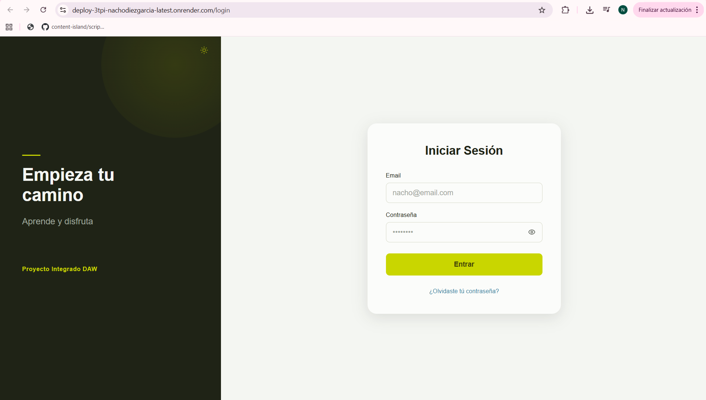
<!-- INSERTAR IMAGEN: captura de la pantalla /login -->

---

## 2. Casos de uso — Admin

Ver diagrama: [`use-cases-admin.puml`](./use-cases-admin.puml)

### Autenticación

| Caso de uso | Descripción |
|---|---|
| Iniciar sesión | Accede con email y contraseña |
| Cerrar sesión | Invalida la sesión y borra la cookie |

### Panel de Administración

Tras el login, el admin accede a `/admin`, donde elige entre gestionar usuarios o trainings.

| Caso de uso | Descripción |
|---|---|
| Ir a gestión de usuarios | Navega a la sección de usuarios |
| Ir a gestión de trainings | Navega a la sección de trainings |

**Pantalla:**

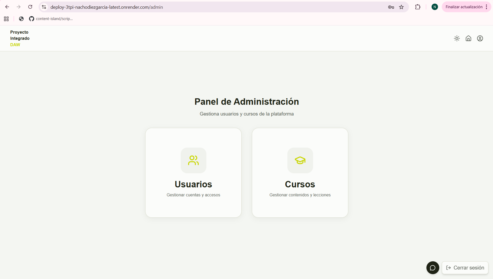

### Gestión de Usuarios

| Caso de uso | Descripción |
|---|---|
| Ver lista de usuarios | Listado de todos los usuarios registrados |
| Ver detalle de usuario | Información del usuario y sus trainings asignados |
| Invitar nuevo usuario | Envía un email de invitación con código de verificación |
| Asignar training a usuario | Desde el detalle de usuario, asigna un training |
| Desasignar training de usuario | Elimina un training asignado al usuario |

**Pantallas:**

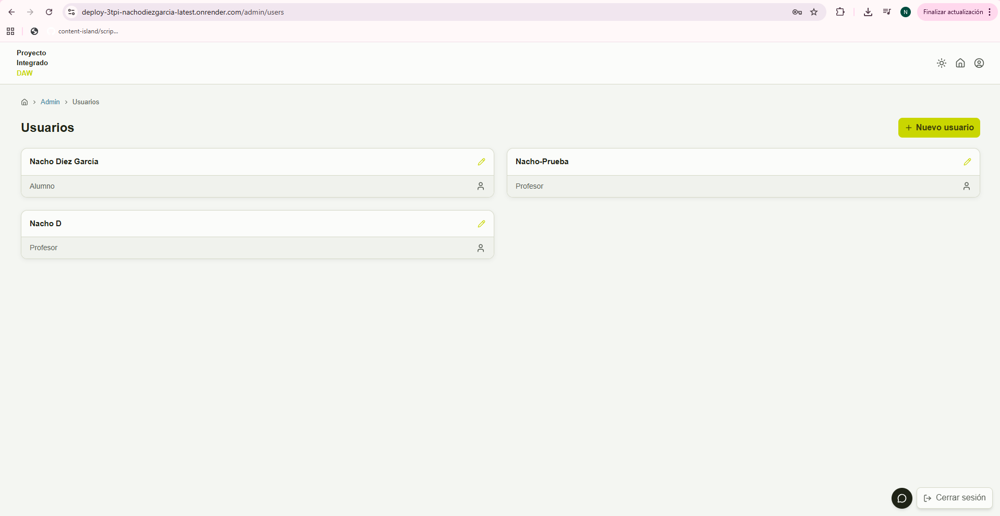

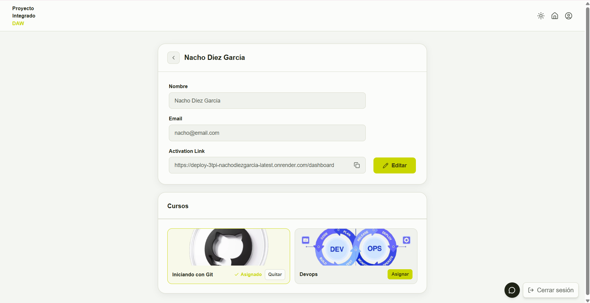

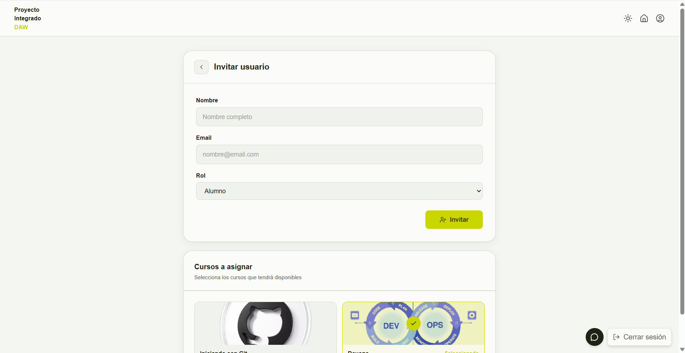

### Gestión de Trainings

| Caso de uso | Descripción |
|---|---|
| Ver lista de trainings | Listado de todos los trainings disponibles |
| Ver detalle de training | Información del training (nombre, curso del CMS, alumnos asignados) |
| Crear nuevo training | Vincula un nombre con un ID de curso del CMS (Content Island) |
| Editar training | Modifica el nombre o el curso vinculado |

**Pantallas:**

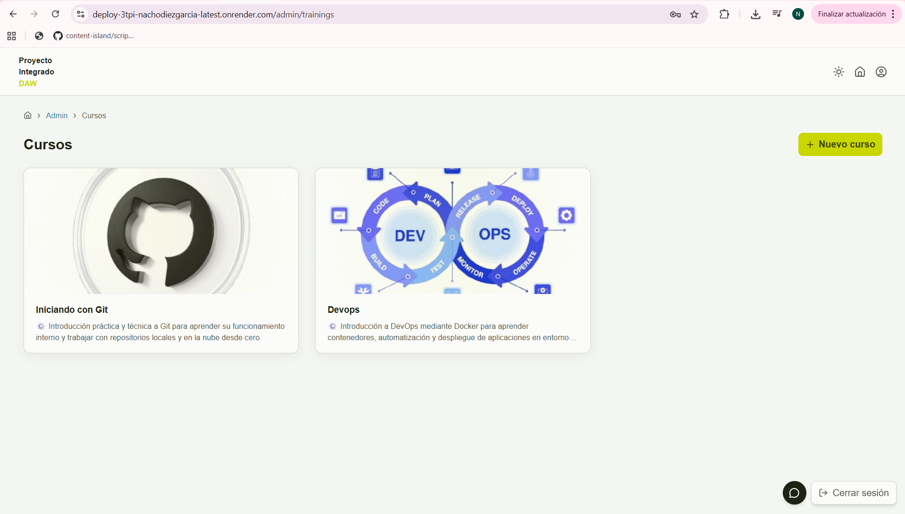

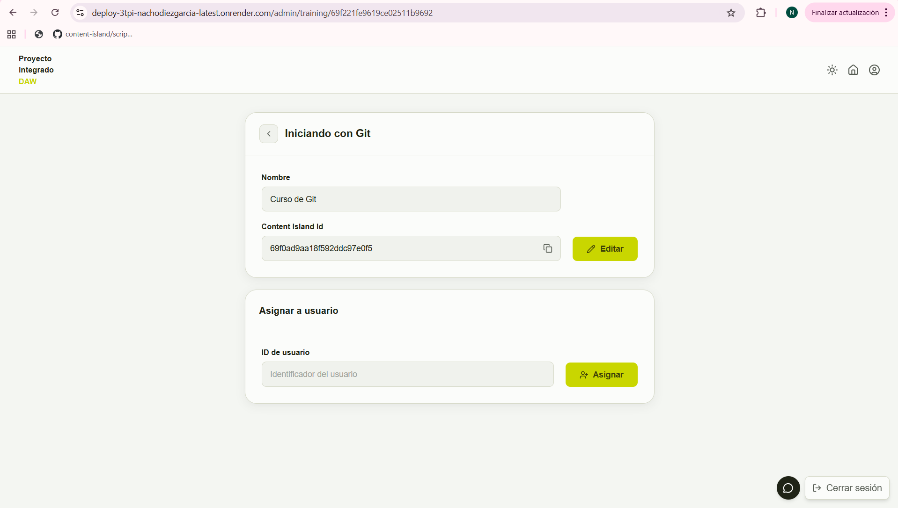

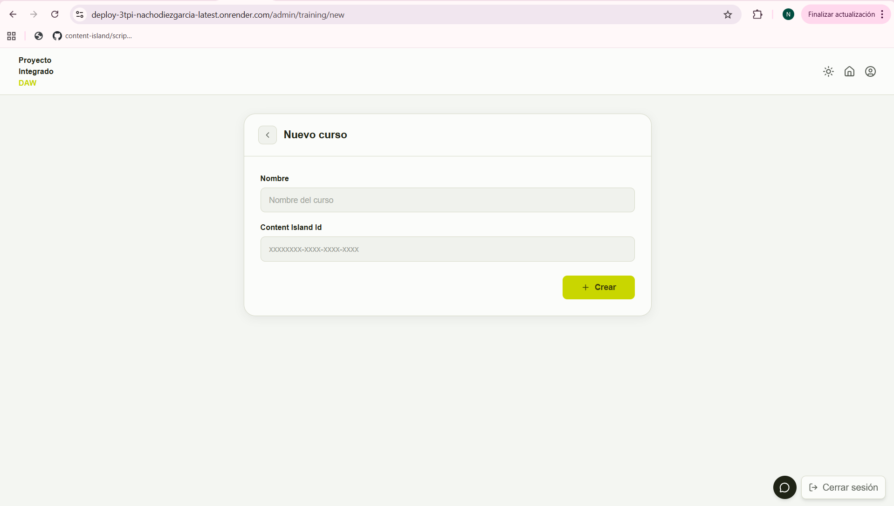

### Mentor IA

El admin también tiene acceso al chat del Mentor IA, igual que un estudiante.

| Caso de uso | Descripción |
|---|---|
| Abrir chat del mentor IA | Abre el FAB de chat con la IA |
| Enviar consulta al mentor | Escribe y envía un mensaje al asistente |
| Recibir respuesta del mentor | La IA responde en streaming vía OpenRouter |

**Pantalla:**

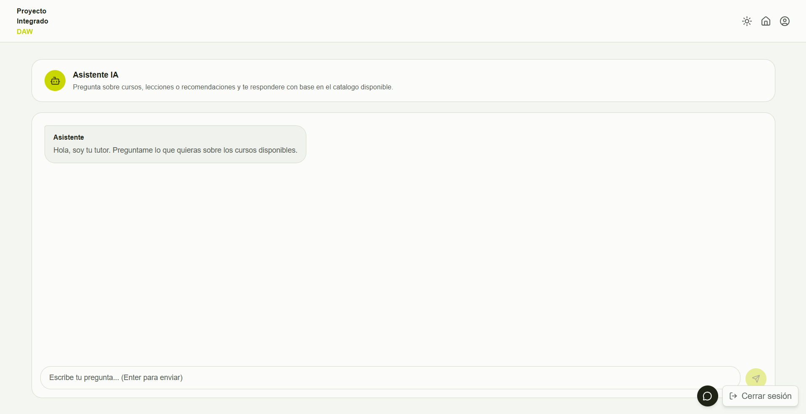

---

## 3. Casos de uso — Student

Ver diagrama: [`use-cases-student.puml`](./use-cases-student.puml)

### Autenticación y Registro

El registro no es autoservicio: el admin invita al estudiante por email.

| Caso de uso | Descripción |
|---|---|
| Iniciar sesión | Accede con email y contraseña |
| Verificar código de email | Introduce el código recibido en el email de invitación |
| Activar cuenta y crear contraseña | Establece su contraseña para completar el registro |
| Cerrar sesión | Invalida la sesión y borra la cookie |

**Pantallas:**

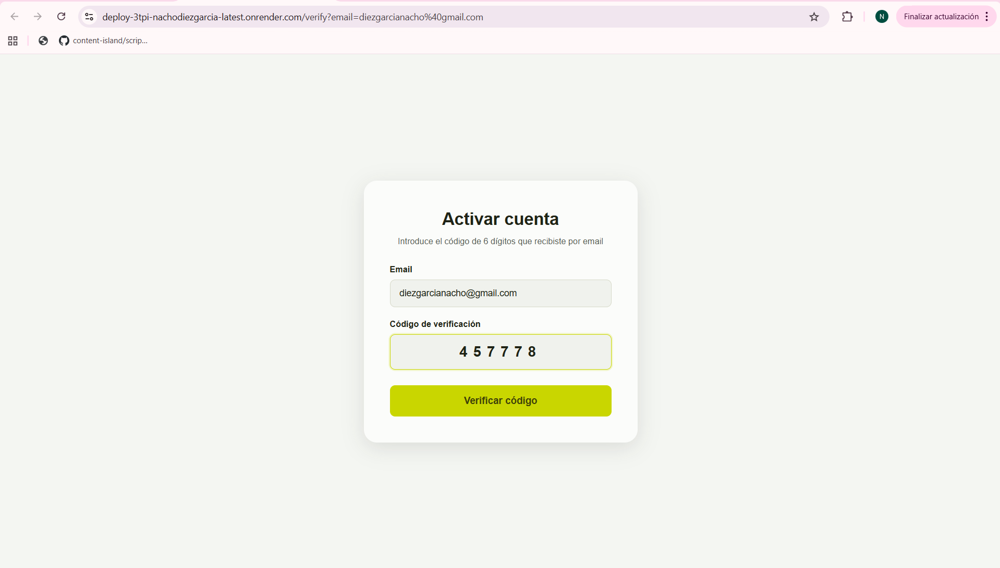

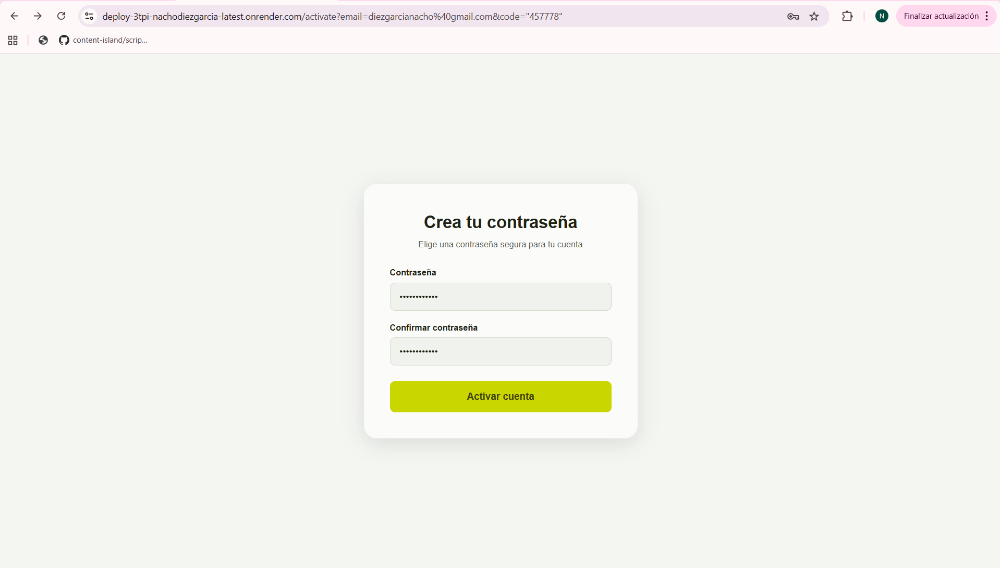

### Aprendizaje

| Caso de uso | Descripción |
|---|---|
| Ver mis cursos | Dashboard con los cursos asignados por el admin |
| Ver detalle de curso | Lista de lecciones del curso con su duración |
| Ver lección | Contenido completo: video + descripción en Markdown |
| Reproducir video de lección | Player de video integrado |
| Leer contenido de lección | Texto de apoyo renderizado en Markdown |

**Pantallas:**

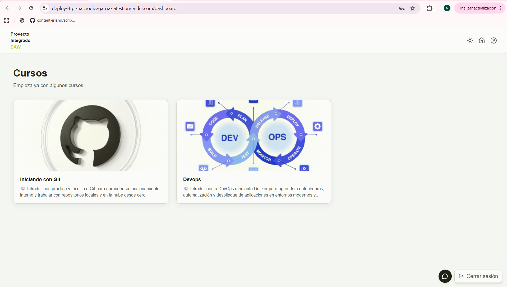

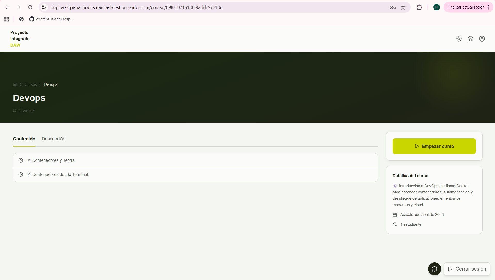

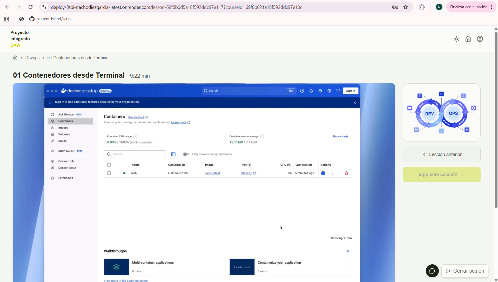

### Mentor IA

| Caso de uso | Descripción |
|---|---|
| Abrir chat del mentor IA | Abre el FAB de chat disponible en todas las páginas protegidas |
| Enviar consulta al mentor | Escribe y envía un mensaje al asistente |
| Recibir respuesta del mentor | La IA responde con contexto de los cursos activos del estudiante |

**Pantalla:**

